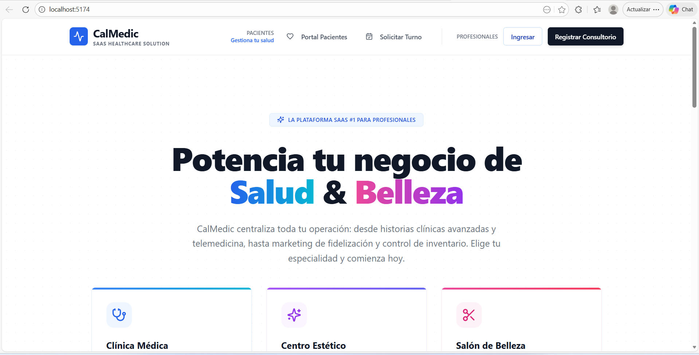
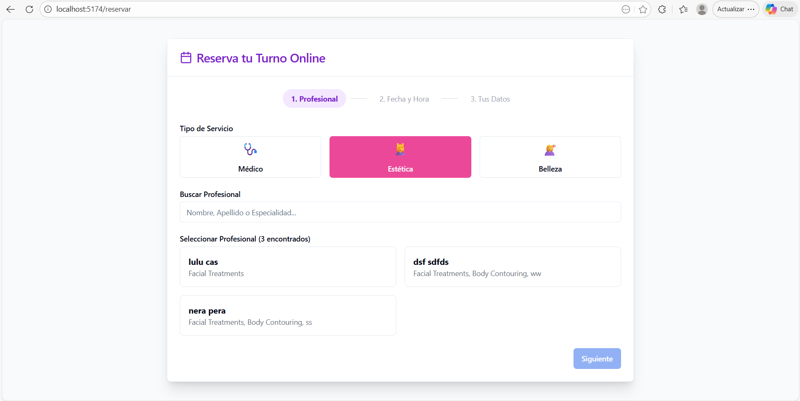
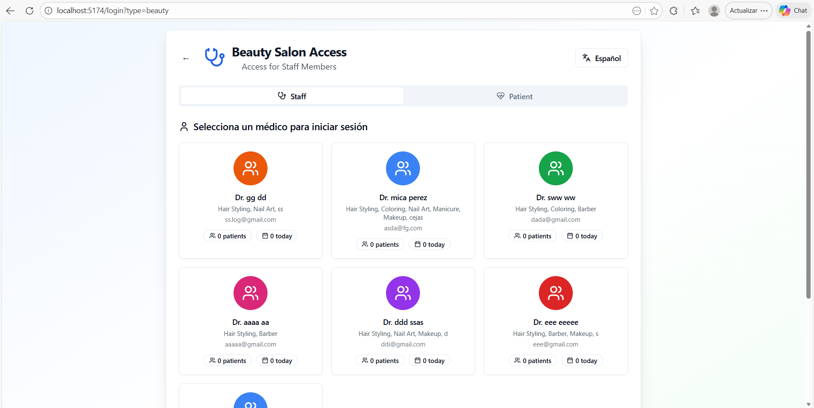

# 🏥 CalMedic - Sistema de Gestión Médica Integral (SaaS)

**CalMedic** es una solución SaaS moderna diseñada para optimizar la gestión sanitaria, conectando a pacientes, médicos e instituciones en una plataforma unificada. Este repositorio contiene el **Frontend** de la aplicación, desarrollado con tecnologías de última generación para asegurar velocidad, escalabilidad y una experiencia de usuario fluida.


---

## 📸 Capturas de Pantalla

*(Vista previa de la plataforma funcionando)*

| Home Institucional | Reserva de Turnos | Acceso Profesional |
|:---:|:---:|:---:|
|  |  |  |

---

## 🚀 Características Principales

### 👨‍⚕️ Para Especialistas y Centros Médicos
*   **Gestión de Agenda:** Panel interactivo para administrar turnos, bloqueos de horarios y sobreturnos.
*   **Historia Clínica Digital:** Registro seguro de pacientes, antecedentes y evoluciones.
*   **Dashboard Financiero:** Métricas de rendimiento, ingresos por consultas y estadísticas de atención.
*   **Gestión de Perfil:** Personalización de horarios de atención, precios y especialidades (Médicas y Estéticas).

### 🙋‍♀️ Para Pacientes
*   **Reserva Online 24/7:** Sistema público de turnos con filtros por especialidad, profesional y obra social.
*   **Portal de Pacientes:** Acceso a historial de turnos y gestión de datos personales.
*   **Recordatorios:** Integración para notificaciones automáticas.

---

## 🛠️ Tecnologías Utilizadas

*   **Frontend Framework:** React 18 + TypeScript
*   **Build Tool:** Vite
*   **Estilos:** Tailwind CSS
*   **Componentes UI:** Shadcn/ui + Lucide Icons
*   **Gestión de Estado:** React Query (TanStack Query)
*   **Enrutamiento:** React Router Dom
*   **Integración Backend:** Supabase Client (Auth & Database connection)

---

## 📦 Instalación y Despliegue Local

1.  **Clonar el repositorio**
    ```bash
    git clone https://github.com/DanielCostella/CalMedic--Registro-Medico.git
    cd CalMedic--Registro-Medico
    ```

2.  **Instalar dependencias**
    ```bash
    npm install
    # o
    pnpm install
    ```

3.  **Configurar Variables de Entorno**
    Crear un archivo `.env` basado en el template y agregar las credenciales de Supabase:
    ```env
    VITE_SUPABASE_URL=tu_url_supabase
    VITE_SUPABASE_ANON_KEY=tu_key_supabase
    ```

4.  **Iniciar Servidor de Desarrollo**
    ```bash
    npm run dev
    ```

---

## 📄 Estructura del Proyecto

*   `/src/components`: Componentes reutilizables (UI, Layouts, Formularios).
*   `/src/pages`: Vistas principales (AdminPage, DoctorDashboard, PublicBooking, etc.).
*   `/src/services`: Lógica de conexión con Supabase.
*   `/src/hooks`: Custom Hooks para lógica de negocio.
*   `/src/types`: Definiciones de TypeScript.

---

**© 2026 CalMedic - Todos los derechos reservados.**
